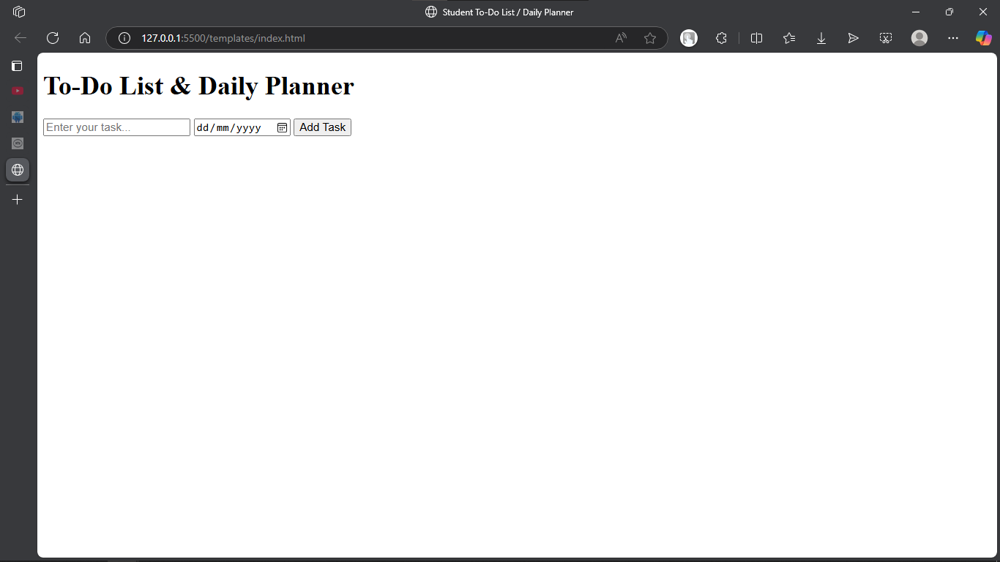

# Otuno's Simple To-Do List App (Flask + HTML + CSS + JS)

This is a lightweight and beginner-friendly **To-Do List App** built using **Python Flask** for the backend and **HTML, CSS, and JavaScript** for the frontend. It allows users to add, view, and delete tasks in real time — all in a single-page application format.

---

## 📸 Screenshot

---

## 🚀 Features

- Add new tasks
- View all tasks
- Delete tasks
- Fully dynamic (AJAX-powered, no page reloads)
- Clean and minimal design
- Built entirely with Flask (no database, uses in-memory list)

---

## 🧰 Tech Stack

- **Backend:** Python 3, Flask
- **Frontend:** HTML5, CSS3, Vanilla JavaScript
- **Storage:** In-memory list (resets on app restart)

---

## 📁 Project Structure

